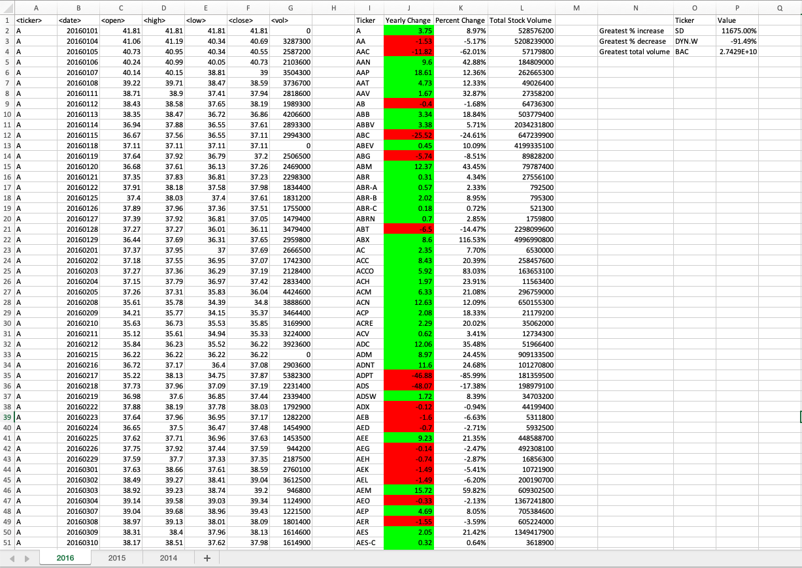

# Stock Market Data Analysis using VBA

VBA Homework - The VBA of Wall Street

## Background

In this homework assignment we will use VBA scripting to analyze real stock market data.

## Data

* [Test Data](Resources/alphabetical_testing.xlsx) - Use the test data to develop the scripts

* [Stock Data](Resources/Multiple_year_stock_data.xlsx) - Run the scripts with the real stock market data to generate the final homework report

## Analysis

* Create a script that will loop through all the stocks for one year and output the following information.

  * The ticker symbol.

  * Yearly change from opening price at the beginning of a given year to the closing price at the end of that year.

  * The percent change from opening price at the beginning of a given year to the closing price at the end of that year.

  * The total stock volume of the stock.

* You should also have conditional formatting that will highlight positive change in green and negative change in red.

### Copyright

Trilogy Education Services © 2019. All Rights Reserved.
